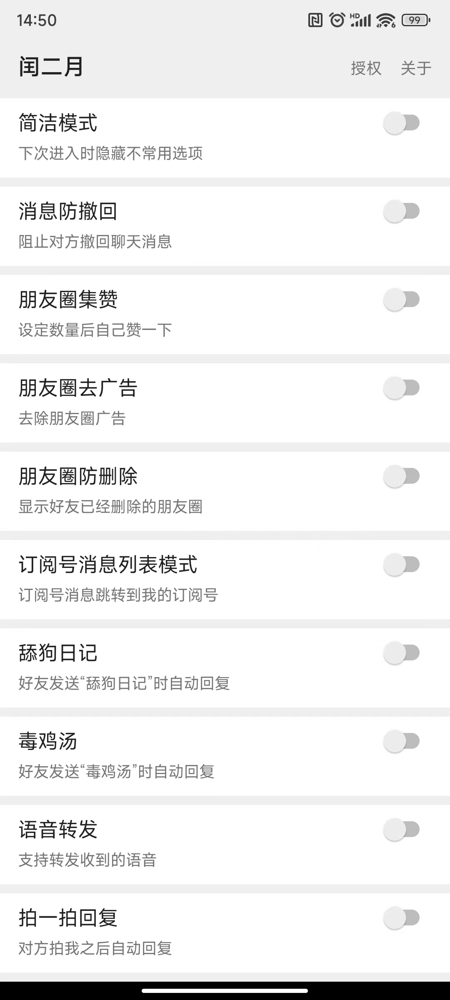
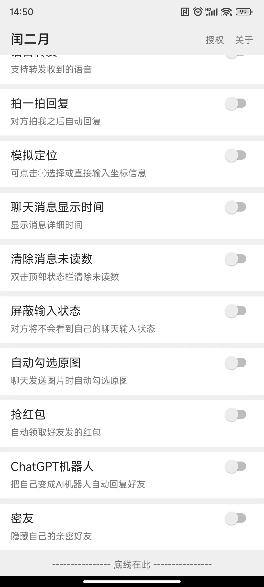

# LeapFebruary(闰二月)

一个小而美的微信模块，~~功能陆续更新中~~铁拳，停更

## 常见问题 [点我](https://github.com/Xposed-Modules-Repo/com.r.leapfebruary/blob/main/FAQ.md)  [点我](https://sourceforge.net/p/com-r-leapfebruary/code/ci/main/tree/FAQ.md)  [点我](https://bitbucket.org/prong6542/com.r.leapfebruary/src/main/FAQ.md)  

## 使用说明  

+ 目前支持的微信版本：  
官网版本:8.0.45、8.0.46、8.0.47、8.0.48、8.0.49、8.0.50（首推荐版本）  
GooglePlay 版本:8.0.42（2424）、8.0.42（2429）
+ 模块激活后(如果你不知道什么是模块激活，先看一下[常见问题](https://github.com/Xposed-Modules-Repo/com.r.leapfebruary/blob/main/FAQ.md) )，在微信内点击“我->设置->插件”可进入模块设置界面

## 下载  

+ 模块最新版  
2.38
[地址1](https://bitbucket.org/prong6542/com.r.leapfebruary/downloads/leapfebruary_238_2.38.apk)
[地址2](https://sourceforge.net/projects/com-r-leapfebruary/files/238-2.38/leapfebruary_238_2.38.apk)
[地址3](https://github.com/Xposed-Modules-Repo/com.r.leapfebruary/releases/download/238-2.38/leapfebruary_238_2.38.apk)  
+ 官网版本微信安装包下载  
8.0.50 (weixin8050android2620_0x2800323c_arm64.apk)
[地址1](http://dldir1.qq.com/weixin/android/weixin8050android2620_0x2800323c_arm64.apk)
[地址2](https://bitbucket.org/prong6542/com.r.leapfebruary/downloads/weixin8050android2620_0x2800323c_arm64.apk)
[地址3](https://sourceforge.net/projects/com-r-leapfebruary/files/238-2.38/weixin8050android2620_0x2800323c_arm64.apk)
[地址4](https://github.com/Xposed-Modules-Repo/com.r.leapfebruary/releases/download/238-2.38/weixin8050android2620_0x2800323c_arm64.apk)  
8.0.49 (weixin8049android2600_0x28003133_arm64.apk)
[地址1](http://dldir1.qq.com/weixin/android/weixin8049android2600_0x28003133_arm64.apk)
[地址2](https://bitbucket.org/prong6542/com.r.leapfebruary/downloads/weixin8049android2600_0x28003133_arm64.apk)
[地址3](https://sourceforge.net/projects/com-r-leapfebruary/files/237-2.37/weixin8049android2600_0x28003133_arm64.apk)
[地址4](https://github.com/Xposed-Modules-Repo/com.r.leapfebruary/releases/download/237-2.37/weixin8049android2600_0x28003133_arm64.apk)  

## 交流  

+ TG群 [t.me/leapfebruary](https://t.me/leapfebruary)  

## 截图  

